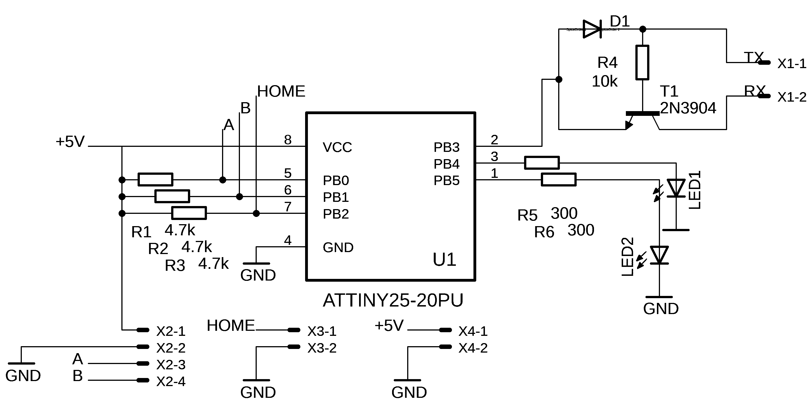

# Star Chaser: Automatic Dome Controller
## Encoder Circuit ##

The encoder circuit is responsible for recording the two 90° out of phase pulses from the rotary encoder. The square waveform, shown below, is measured by the ATTiny25 pins P0 and P1.

The encoder circuit is simple, but powerful due to its modular nature. The ATTiny25 is powered from a regulated 5V power bus. Each encoder phase is pulled up through a 4.7k resistor to 5V as is required by an open-collector encoder.

The pros and cons of this is discussed over at CUI Inc https://www.cui.com/blog/comparison-of-common-encoder-output-signals.

The third input, the home switch, is attached to P2 configured as an external interrupt. Again this pin is pulled high by a 4.7k resistor which is grounded by a reed switch in the presence of a magnetic field. This falling edge triggers an interrupt on the ATTiny25 which resets the pulse count to zero.

The board communicates with the controller chip using a software half-duplex serial UART based on a design by Ralph Doncaster which allows only one pin on the ATTiny to be used to both send and receive data. The library compiles to only 62 bytes of memory which is perfect due to the limited memory available on the microcontroller. A more indepth description of the circuit is available from http://nerdralph.blogspot.com/2014/01/avr-half-duplex-software-uart.html.

Two status LED's indicate the rotation direction of the dome as measured by the encoders.